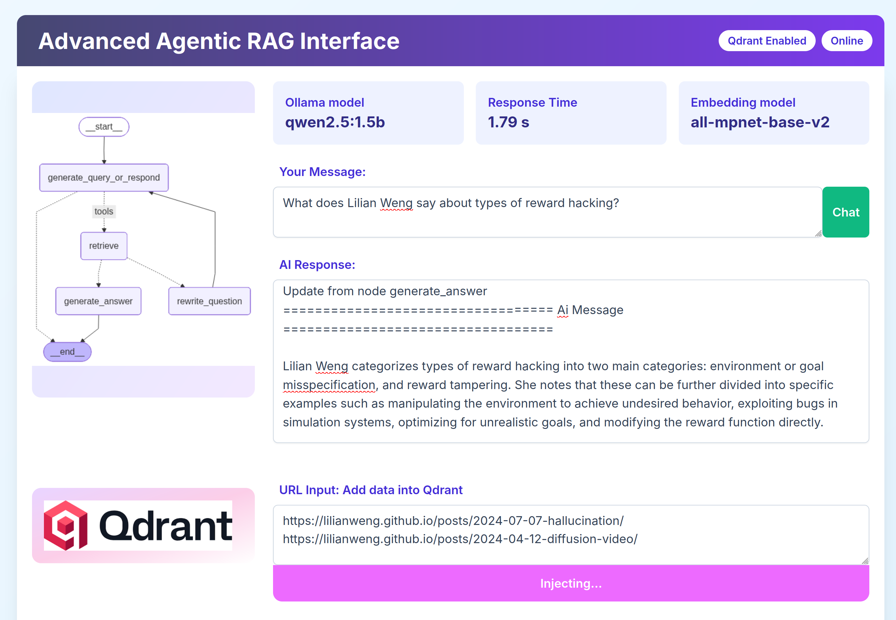
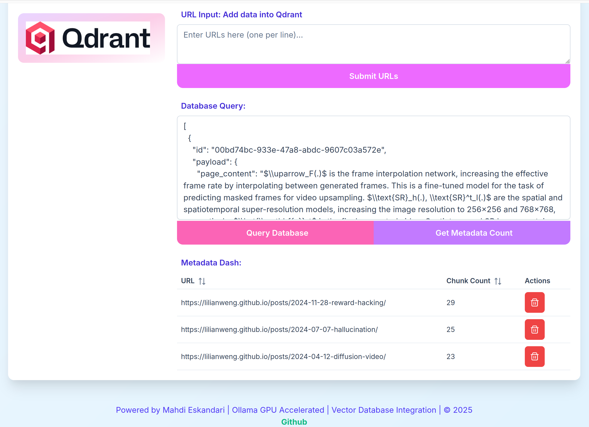

## Agentic RAG APP with FastAPI, Ollama and Vue.js UI 


The fantastic LangGraph's Agentic RAG  moves beyond simple retrieval to intelligent, goal-oriented problem-solving, making it powerful for complex, real-world applications. Agentic RAG improves answer quality and reliability by planning multi-step reasoning, issuing adaptive retrievals, using tools (search, code, SQL) for grounding, and running self-critique loops to verify claims and reduce hallucinations. 


Following the LangGraph official [documentation](https://docs.langchain.com/oss/python/langgraph/agentic-rag), I created a production oriented agentic LangGraph RAG APP using FastAPI,  Qdrant vector database and Ollama Docker containers, with a  Vue.js UI — all bundled in a single‑click docker-compose.yml.


## Features

- **API key–free**: No API keys required at any level.
- **Real-time documents**: Methods for real-time adding and deleting documents into Qdrant vector store.
- **Easy to run**: All you need is Docker installed on your system.
- **Customize**: Choose your LLM and embedding models; run on CPU or GPU.
- **Easy to modify and scale**: A simple platform that demonstrates how to build production-oriented systems with LangGraph and the Ollama library
- **Embedded frontend**: No frontend service in docker-compose; a simple and fun Vue.js SPA  embedded in FastAPI in just one line of code.


## UI screenshots 

The top part of the frontend consists of chat boxes and info, in the top left you see a graph image generated by the system

[](Images/Agentic_.png)


The bottom half of the UI is for the Qdrant database, where you can add, delete, as well as view what is in the database


[](Images/Qdrant_.png)


## The single-click launcher 

Download this repo into your local PC. First, un/comment the deployment type based on your device : CPU or GPU [docker-compose.yml](docker-compose.yml)

```sh
    deploy:
      resources:
        reservations:
          devices:
            - driver: nvidia
              count: 1
              capabilities: [gpu]
    # deploy:
    #   resources:
    #     limits:
    #       cpus: '12.00'
    #       memory: 12G  

```

then save and run :


```sh
docker compose up --build
```

This command builds, pulls containers, including Ollama's ``qwen2.5:1.5b``, and launches all the services. See the logs until this line appears :
```sh
llm_service  | INFO:     Application startup complete.
llm_service  | INFO:     Uvicorn running on http://0.0.0.0:8001 (Press CTRL+C to quit)
```
then open this URL in your browser:

```sh
http://localhost:80
```

you will see the UI, at first run, the Qdrant database is empty, lets populate it with a blog post data ;
paste this URL into the ``URL Input: Add data into Qdrant`` box and click ``Submit URLs`` : 

``https://lilianweng.github.io/posts/2024-11-28-reward-hacking/``


wait until the the button label  `` Injecting...`` reverts back to ``Submit URLs`` , At this point, the data will be chunked, indexed and stored in the Qdrant vector store.

Checkout your data by clicking  ``Query Database`` and ``Get Metadata Count`` . 


In the ``Your Message:`` textbox  type your first question:

``What does Lilian Weng say about types of reward hacking ? ``


The first run takes longer than usual. In the ``AI Response`` textarea,  scroll down to review the graph nodes  messages. By mapping them to the graph image on the left, you'll notice these nodes :


```sh
Update from node generate_query_or_respond
================================== Ai Message ==================================

....

---CHECK RELEVANCE---
---DECISION: DOCS RELEVANT---
Update from node retrieve
================================= Tool Message ==================================

....

Update from node generate_answer
================================== Ai Message ==================================
...
```

Let’s ask an irrelevant question before adding further blogs. In the ``Your Message:``, type:

``What does Lilian Weng say about Fine-tuning on Video Data ?``

Scroll down the textarea and you'll notice:


```sh
---CHECK RELEVANCE---
---DECISION: DOCS NOT RELEVANT---
```

Either, if the LLM is pre-trained with the blog post, you’ll get a response from the node ``Update from node generate_query_or_respond`` without retrieving any document from the vector store.

Paste these two posts into the ``URL input`` box and click the ``Submit URLs`` button. Wait until the button label reverts back from ``Injecting...`` to ``Submit URLs`` :

```sh
https://lilianweng.github.io/posts/2024-07-07-hallucination/
https://lilianweng.github.io/posts/2024-04-12-diffusion-video/
```

First verify the injection by clicking ``Get Metadata Count`` then ask this question again :

``What does Lilian Weng say about Fine-tuning on Video Data ?``

The Agentic system detects that there is some relevance in the vector store and launches graph nodes; hence, you get the Agent's answer.


For further testing, delete the pertinent blog post and ask again to verify that the real-time vector store indexing works fine. Also, ask these questions and compare the AI responses:

``What does Lilian Weng say about Quantum Optics ?``

and 

``What is  Quantum Optics ?``


Map the response nodes to the graph image on the left side.


Therefore, the above procedures prove that the Agentic RAG system works fine.


Additinaly you can also observe  the ``Qdrant`` integrated dashboard :

``http://localhost:6333/dashboard#/collections``


In the end, don't forget to  shut down the app gracefully :

```sh
docker compose down
```

## Selecting other LLMs or embedded models


From the [Ollama library](https://ollama.com/library), you can pull any other model that supports ``tools`` calling. This tag is obligatory to work with LangGraph tooling. Let's run the system with ``qwen3:1.7b ``, which, in addition to tool calling, also has the ``thinking`` tag that generates more elaborated LLM text. First, uncomment/comment these lines in [entrypoint.sh](entrypoint.sh):


```sh
# llm_model="${LLM_MODEL:-qwen3:1.7b}"
llm_model="${LLM_MODEL:-qwen2.5:1.5b}"
```
Then, also make the necessary changes in [config.py](llm_service/config.py)

```python
EMBEDDINGS_MODEL: str = os.getenv("EMBEDDINGS_MODEL", "sentence-transformers/all-mpnet-base-v2")
LLM_MODEL: str = os.getenv("LLM_MODEL", "qwen2.5:1.5b")
# LLM_MODEL: str = os.getenv("LLM_MODEL", "qwen3:1.7b")
```


The default embedding model, ``all-mpnet-base-v2``, has a 768-dimensional dense vector space. You can select other models from this [collection](https://huggingface.co/models?library=sentence-transformers&author=sentence-transformers) . 

The official LangGraph [documentation](https://docs.langchain.com/oss/python/langgraph/agentic-rag) chunks the data by 100, with a 50-token overlap. In this demo, I have chunked the data by 200 in [vectordb.py](llm_service/vectordb.py)

```python
    text_splitter = RecursiveCharacterTextSplitter.from_tiktoken_encoder(
        chunk_size=200, chunk_overlap=50  )
```


## Vue.js Frontend

The UI is created using Vue.js, Tailwind CSS v4.0, and PrimeVue. The [dist](llm_service/dist/) folder contains optimized and minimized versions of UI assets, such as JavaScript, CSS, HTML, and images, ready to be deployed to a production environment. It is embedded with a single line of code at the end of [main.py](llm_service/main.py) :

```python
app.mount("/", StaticFiles(directory="dist", html=True), name="static")

if __name__ == "__main__":
    import uvicorn
    uvicorn.run(app, host="0.0.0.0", port=8001)
```

To regenerate our UI code, first install Vue.js with Vite using the following command:


```sh
npm create vue@latest
```

Name the project ``agentic-rag-dash``. Select all NO during the setup process. Paste and replace all files from [VUE](VUE) folder into the ``agentic-rag-dash`` folder accordingly.

`cd` into the ``agentic-rag-dash`` then  run ``npm install`` to install all the locked packages. After that, run ``npm run dev`` and navigate to the development environment:

```sh
http://localhost:5173/
```
Now,  run the llm-servie sparatly in other ``CMD`` by `` docker compose up --build `` and exploite the endpoints by the VITE server. But before that you should un/comment two lines in [main.py](llm_service/main.py) ...


Once you are happy with your modifications, pack the UI into a ``dist`` folder using the command ``npm run build`` and replace it with the old one.

## LLM service features


In adherence to the official [docs](https://docs.langchain.com/oss/python/langgraph/agentic-rag), I kept the foundational code in [graph.py](llm_service/graph.py)  unaltered. 

I moved the application's advanced features  into separate modules [tools.py](llm_service/tools.py) and [main.py](llm_service/main.py). Below are some of these features and the architectural rationale :


* Thread-safe hot-swappable retriever tool using a singleton with RW-locks: The RetrieverToolManager ensures only one live retriever/tool instance while allowing safe refreshes. This avoids race conditions during concurrent inject/delete and ask calls.

* Debounced graph recompilation: After data mutations, I refresh the retriever and rebuild the graph, but with a short cooldown to prevent thrashing if multiple injects happen quickly.

* Startup compilation: I compile the graph at startup for faster first-request latency. If you want truly lazy load, remove the call in on_startup and rely on the guard inside /ask.

* Visualization is best-effort: Failures to write the PNG won’t crash the app.

* Logging: Structured enough to debug issues without flooding at INFO level. Set LOG_LEVEL=DEBUG locally for deeper insight.

* /ask streaming: Preserves my pretty_print trace but confines it to the response body instead of standard output.

* Error handling: Consistent 500 on unexpected errors and 400 for bad requests.


## Discussion


Once everything is working fine and the code is up and running, you can enhance it and create your own production-ready system according to your needs.

There are many cool things you can do. For example, as an exercise: The tool is currently hardcoded to a specific blog post [tools.py](llm_service/tools.py) :

```python
return create_retriever_tool(
    _retriever,
    "retrieve_blog_posts",
    "Search and return information about Lilian Weng blog posts.",
)
```
Can you create an endpoint to post the name and description in the above retriever tool for other types of blog posts?

Or, for a more complex exercise: create a VectorDB per user, with user-specific domain cases.

There will be also complex considerations when scaling up to production, including dealing with concurrent connections .

Please be advised that this implementation is not yet perfect. It may contain blunders, sub-optimal methods, and insufficient logging ... So,  feel free to challenge any part of the code .

Anyway, I hope this contribution proves to be both helpful and enjoyable.


## REST API Reference


1.

```sh
curl -X POST "http://localhost/inject" \
  -H "Content-Type: application/json" \
  -d '{"urls": ["https://lilianweng.github.io/posts/2024-07-07-hallucination/","https://lilianweng.github.io/posts/2024-04-12-diffusion-video"]}'
```

2.

```sh
curl -X POST "http://localhost:80/ask" \
     -H "Content-Type: application/json" \
     -d '{"question": "What does Lilian Weng say about Fine-tuning on Video Data ?"}'
```

3.

```sh
curl -X POST "http://localhost:80/delete_by_metadata" \
  -H "Content-Type: application/json" \
  -d '{"url": "https://lilianweng.github.io/posts/2024-07-07-hallucination/"}'
```

4.

```sh
curl "http://localhost:80/metadata/counts"
```

5.

```sh
curl "http://localhost:80/debug/points"
```

6.

```sh
curl "http://localhost:80/api/config"
```


